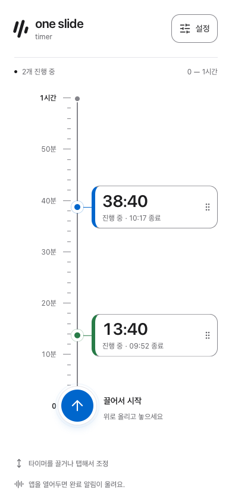

# One Slide Timer

모바일 화면의 세로 시간 레일에서 한 번의 제스처로 여러 타이머를 만들고 조정하는 웹앱입니다.



## 사용 방법

- 아래 시작 핀을 위로 끌어 놓으면 타이머가 시작됩니다.
- 진행 중인 타이머를 끌어 남은 시간을 바꾸거나, 탭해서 조정합니다.
- 드래그 대신 탭·키보드로도 시간을 설정할 수 있습니다.
- 설정에서 시간 범위(5분~12시간), 네 가지 색상 테마, 기기 알림과 알림음을 바꿀 수 있습니다.
- 완료된 타이머는 한 목록으로 모이며, 알림음이 ON이면 확인할 때까지 소리가 반복됩니다.
- 타이머 종료 시각과 설정은 해당 기기의 로컬 저장소에 보관됩니다. 계정·기기 간 동기화는 제공하지 않습니다.

## 알림 지원 범위

- **알림음:** ON/OFF 선택은 새로고침 후에도 유지합니다. ON이면 타이머 등록 조작에서 오디오를 준비하고 완료 시 재생합니다. 새로고침 후 아무 조작 없이 기존 타이머가 완료되면 브라우저 정책에 따라 소리가 나지 않을 수 있습니다.
- **웹 기기 알림:** 지원되는 브라우저의 권한 허용이 필요합니다. 앱이 실행 중일 때 완료를 전달하며, 앱 종료·백그라운드 실행 중단 중의 예약 알림은 보장하지 않습니다. iPhone·iPad의 웹 알림은 지원 OS에서 홈 화면에 추가한 웹앱으로 사용해야 합니다.

## 로컬 실행

Node.js 24와 npm을 사용합니다.

```bash
nvm use
npm ci
npm run dev
```

실행 후 터미널에 표시되는 로컬 주소를 엽니다. API 키나 별도 서버는 필요하지 않습니다.

## 검증

```bash
npm run verify
npx playwright install chromium webkit
npm run verify:browser
```

`verify`는 lint·포맷·타입·단위 테스트를, `verify:browser`는 빌드와 전체 브라우저 검사를 실행합니다. 브라우저 검사는 Chromium, 모바일 WebKit 및 Chromium 터치 환경을 사용하며 실제 iOS 기기 검사를 대신하지 않습니다.

## 기술 구성과 문서

Vite·React·TypeScript를 사용하며, 앱 공유 상태는 Zustand, 레일 상호작용은 XState가 담당합니다. 브라우저 알림 연동은 플랫폼 어댑터로 분리되어 있습니다.

- [제품 스펙](docs/product-spec.md)
- [프로젝트 구조](docs/project-structure.md)
- [디자인 토큰](docs/design-tokens.md)
- [알림 어댑터 구조](src/platform/notifications/README.md)
- [개발 진행 기록](docs/progress.md)
- [제품 용어](CONTEXT.md)

## 라이선스

[MIT License](LICENSE)
